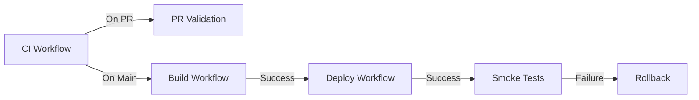

# GitHub Actions Workflows

This directory contains all CI/CD workflows for the ThreatStream Intelligence Platform.

## Overview

We use GitHub Actions for continuous integration, deployment, and quality assurance. Our workflows are designed to:

- ✅ Ensure code quality through automated testing and linting
- 🔒 Maintain security with vulnerability scanning
- 📦 Build and publish Docker images automatically
- 🚀 Deploy to Azure with zero-downtime deployments
- 🔄 Provide automatic rollback on deployment failures
- 📊 Validate pull requests before merge

## Workflows

### 1. CI - Tests & Linting (`ci.yml`)

**Triggers:**
- Push to `main` or `develop` branches
- Pull requests to `main` or `develop` branches

**What it does:**
- Runs Python tests with coverage for ingestion and API modules
- Uploads coverage reports to Codecov
- Runs Python linting (flake8, black, mypy)
- Runs TypeScript/React tests and linting for dashboard
- Builds dashboard to verify production build works
- Scans for security vulnerabilities with Trivy
- Validates Terraform configuration
- Fails the workflow if any job fails

**Jobs:**
1. `test-ingestion` - Run ingestion module tests
2. `test-api` - Run API module tests
3. `lint-python` - Lint Python code
4. `test-dashboard` - Test and build React dashboard
5. `security-scan` - Scan for vulnerabilities
6. `terraform-validate` - Validate Terraform files
7. `ci-success` - Summary job (fails if any job failed)

**Required Secrets:**
- `CODECOV_TOKEN` - For uploading coverage reports (optional)

---

### 2. Build - Docker Images (`build.yml`)

**Triggers:**
- Push to `main` branch
- Git tags matching `v*` (e.g., `v1.0.0`)
- Manual workflow dispatch

**What it does:**
- Builds API Docker image
- Builds Dashboard Docker image
- Pushes images to GitHub Container Registry (ghcr.io)
- Optionally pushes images to Azure Container Registry (ACR)
- Tags images with multiple strategies (branch, SHA, semver, latest)
- Uses layer caching for faster builds

**Jobs:**
1. `build-api` - Build and push API container image
2. `build-dashboard` - Build and push Dashboard container image
3. `push-to-acr` - Push images to Azure Container Registry (runs only on main branch)

**Image Tagging Strategy:**
- `latest` - Latest build from main branch
- `main-abc1234` - Branch name + commit SHA
- `v1.2.3` - Semantic version (from git tags)
- `1.2` - Major.minor version
- `abc1234` - Commit SHA only

**Required Secrets:**
- `GITHUB_TOKEN` - Automatically provided by GitHub
- `AZURE_CREDENTIALS` - Azure service principal credentials (for ACR push)

**Registries:**
- **GitHub Container Registry:** `ghcr.io/your-org/your-repo/api:latest`
- **Azure Container Registry:** `yourregistry.azurecr.io/threatstream-api:latest`

---

### 3. Deploy - Azure Production (`deploy.yml`)

**Triggers:**
- Push to `main` branch (auto-deploy to production)
- Manual workflow dispatch with environment selection

**What it does:**
- Deploys Azure Functions (ingestion module)
- Deploys API to Azure Container Apps
- Deploys Dashboard to Azure Static Web Apps
- Runs smoke tests on all deployed services
- Automatically rolls back on failure
- Verifies health endpoints

**Jobs:**
1. `deploy-functions` - Deploy Python Azure Functions
2. `deploy-api` - Deploy API container to Azure Container Apps
3. `deploy-dashboard` - Deploy React dashboard to Static Web Apps
4. `smoke-tests` - Run health checks on all services
5. `notify-success` - Display success message with URLs
6. `rollback` - Automatic rollback if smoke tests fail

**Manual Deployment:**
```bash
# Trigger manual deployment via GitHub CLI
gh workflow run deploy.yml -f environment=staging
gh workflow run deploy.yml -f environment=production
```

**Required Secrets:**
- `AZURE_CREDENTIALS` - Azure service principal credentials
- `AZURE_RESOURCE_GROUP` - Azure resource group name
- `AZURE_FUNCTIONAPP_NAME` - Azure Functions app name
- `AZURE_CONTAINERAPP_API_NAME` - Container App name for API
- `VITE_API_BASE_URL` - API base URL for dashboard
- `VITE_API_KEY` - API key for dashboard (optional)
- `AZURE_STATIC_WEB_APPS_API_TOKEN` - Static Web Apps deployment token (optional)
- `DASHBOARD_URL` - Dashboard URL for smoke tests (optional)

**Rollback Process:**
If smoke tests fail, the workflow automatically:
1. Identifies the previous Container App revision
2. Activates the previous revision
3. Logs the rollback action

---

### 4. PR Validation (`pr.yml`)

**Triggers:**
- Pull request opened, synchronized, or reopened
- Pull request marked as ready for review

**What it does:**
- Validates PR title format (conventional commits)
- Checks PR description length
- Reviews dependencies for security issues
- Analyzes code complexity and quality
- Runs security scans with Bandit
- Checks test coverage requirements (70% minimum)
- Analyzes changed files by type
- Calculates PR size (XS, S, M, L, XL)
- Checks if documentation was updated
- Auto-assigns reviewers based on files changed

**Jobs:**
1. `pr-check` - Validate PR metadata (title, description, labels)
2. `dependency-review` - Review dependencies for vulnerabilities
3. `code-quality` - Analyze code complexity and security
4. `coverage-check` - Ensure test coverage meets requirements
5. `changed-files` - Analyze what types of files changed
6. `pr-size` - Calculate PR size and warn if too large
7. `docs-check` - Check if docs were updated
8. `assign-reviewers` - Auto-assign reviewers
9. `validation-summary` - Summary of all checks

**PR Title Format:**
Must start with one of:
- `feat:` - New feature
- `fix:` - Bug fix
- `docs:` - Documentation changes
- `refactor:` - Code refactoring
- `test:` - Test changes
- `chore:` - Maintenance tasks
- `perf:` - Performance improvements
- `ci:` - CI/CD changes
- `build:` - Build system changes
- `style:` - Code style changes

**Examples:**
```
✅ feat: Add real-time threat feed to dashboard
✅ fix: Resolve memory leak in enrichment pipeline
✅ docs: Update API documentation with new endpoints
❌ Add new feature (missing prefix)
❌ updated code (not descriptive)
```

---

## Required GitHub Secrets

### Setting Up Secrets

Navigate to: **Settings → Secrets and variables → Actions → New repository secret**

### Core Secrets

#### `AZURE_CREDENTIALS`
Azure service principal credentials in JSON format.

<details>
<summary>How to create Azure Service Principal</summary>

```bash
# Create service principal
az ad sp create-for-rbac \
  --name "github-actions-threatstream" \
  --role contributor \
  --scopes /subscriptions/{subscription-id}/resourceGroups/{resource-group} \
  --sdk-auth

# Output will be JSON - copy entire output to secret
{
  "clientId": "...",
  "clientSecret": "...",
  "subscriptionId": "...",
  "tenantId": "...",
  "activeDirectoryEndpointUrl": "https://login.microsoftonline.com",
  "resourceManagerEndpointUrl": "https://management.azure.com/",
  "activeDirectoryGraphResourceId": "https://graph.windows.net/",
  "sqlManagementEndpointUrl": "https://management.core.windows.net:8443/",
  "galleryEndpointUrl": "https://gallery.azure.com/",
  "managementEndpointUrl": "https://management.core.windows.net/"
}
```
</details>

#### `AZURE_RESOURCE_GROUP`
Name of the Azure resource group where resources are deployed.

```
Example: rg-threatstream-prod
```

#### `AZURE_FUNCTIONAPP_NAME`
Name of the Azure Functions app for ingestion.

```
Example: func-threatstream-prod-abc123
```

#### `AZURE_CONTAINERAPP_API_NAME`
Name of the Container App running the API.

```
Example: ca-threatstream-prod-api
```

### Optional Secrets

#### `CODECOV_TOKEN`
Token for uploading coverage reports to Codecov.

<details>
<summary>How to get Codecov token</summary>

1. Go to [codecov.io](https://codecov.io)
2. Sign in with GitHub
3. Add your repository
4. Copy the upload token
5. Add to GitHub secrets

</details>

#### `VITE_API_BASE_URL`
Base URL for the API (used by dashboard).

```
Example: https://ca-threatstream-prod-api.azurecontainerapps.io
```

#### `VITE_API_KEY`
API key for authenticating dashboard requests.

```
Example: sk_live_abc123xyz789
```

#### `AZURE_STATIC_WEB_APPS_API_TOKEN`
Deployment token for Azure Static Web Apps.

<details>
<summary>How to get Static Web Apps token</summary>

1. Go to Azure Portal
2. Navigate to your Static Web App
3. Click **Manage deployment token**
4. Copy the token
5. Add to GitHub secrets

</details>

#### `DASHBOARD_URL`
Public URL of the deployed dashboard.

```
Example: https://threatstream-dashboard.azurestaticapps.net
```

---

## GitHub Environments

We use GitHub Environments for deployment protection and secret management.

### Creating Environments

1. Go to **Settings → Environments**
2. Create environments: `production` and `staging`
3. Add protection rules:
   - ✅ Required reviewers (for production)
   - ✅ Wait timer (optional)
   - ✅ Deployment branches (main only for production)

### Environment-Specific Secrets

Secrets can be scoped to specific environments:

**Production Environment:**
- All Azure secrets (production resources)
- Production API keys
- Production dashboard URL

**Staging Environment:**
- Staging Azure secrets
- Staging API keys
- Staging dashboard URL

---

## Workflow Dependencies



### Execution Order

1. **PR Opened:** `ci.yml` + `pr.yml` run in parallel
2. **PR Merged to Main:** `ci.yml` runs
3. **CI Success:** `build.yml` runs
4. **Build Success:** `deploy.yml` runs
5. **Deploy Success:** Smoke tests run
6. **Smoke Test Failure:** Automatic rollback

---

## Local Testing

### Test Python Code Locally

```bash
# Install dependencies
cd ingestion
pip install -r requirements.txt
pip install pytest pytest-cov pytest-asyncio

# Run tests
pytest tests/ --cov=. --cov-report=term-missing

# Run linting
flake8 . --max-line-length=100 --exclude=venv,.pytest_cache
black --check .
mypy . --ignore-missing-imports
```

### Test Dashboard Locally

```bash
# Install dependencies
cd dashboard
npm ci

# Run tests
npm test

# Run linting
npm run lint

# Type checking
npm run type-check || npx tsc --noEmit

# Build
npm run build
```

### Test Terraform Locally

```bash
cd infrastructure

# Format check
terraform fmt -check -recursive

# Initialize
terraform init -backend=false

# Validate
terraform validate
```

### Test Docker Builds Locally

```bash
# Build API image
docker build -t threatstream-api:local ./api

# Build Dashboard image
docker build -t threatstream-dashboard:local ./dashboard --target production

# Test with docker-compose
docker-compose up
```

---

## Troubleshooting

### Common Issues

#### 1. Azure Login Fails

**Error:** `Azure login failed`

**Solution:**
- Verify `AZURE_CREDENTIALS` secret is correct JSON format
- Ensure service principal has correct permissions
- Check if service principal credentials expired

```bash
# Test credentials locally
az login --service-principal \
  --username $CLIENT_ID \
  --password $CLIENT_SECRET \
  --tenant $TENANT_ID
```

#### 2. Coverage Upload Fails

**Error:** `Codecov upload failed`

**Solution:**
- Verify `CODECOV_TOKEN` is set correctly
- Check if repository is added to Codecov
- Review Codecov logs in workflow output

#### 3. Container App Deployment Fails

**Error:** `Container image not found`

**Solution:**
- Ensure `build.yml` completed successfully
- Verify image exists in ACR: `az acr repository list --name <acr-name>`
- Check image tag matches deployment reference

#### 4. Smoke Tests Fail

**Error:** `Health check endpoint returned 404`

**Solution:**
- Verify applications have health endpoints at `/health` or `/api/health`
- Check container logs: `az containerapp logs show --name <app-name>`
- Ensure environment variables are set correctly

#### 5. PR Validation Fails on Title

**Error:** `PR title must start with one of: feat:, fix:, ...`

**Solution:**
- Update PR title to follow conventional commit format
- Examples: `feat: add new feature`, `fix: resolve bug`

---

## Monitoring Workflows

### GitHub Actions UI

1. Go to **Actions** tab in GitHub
2. View all workflow runs
3. Click on a run to see detailed logs
4. Download artifacts (coverage reports, security scans)

### Notifications

Configure workflow notifications:

1. Go to **Settings → Notifications**
2. Enable **Actions** notifications
3. Choose notification method (email, Slack, etc.)

### Workflow Status Badges

Add to your README:

```markdown


```

---

## Cost Optimization

### GitHub Actions Minutes

- **Free tier:** 2,000 minutes/month for private repos
- **Cost:** $0.008/minute after free tier

**Optimization strategies:**
1. Use caching for dependencies (`cache: 'pip'`, `cache: 'npm'`)
2. Use matrix builds sparingly
3. Skip jobs when not needed (e.g., deploy only on main)
4. Use `if` conditions to skip unnecessary jobs

### Azure Costs

**Deployment costs:**
- Azure Functions: Consumption plan (~$0.20/million executions)
- Container Apps: ~$0.000024/vCPU-second
- Cosmos DB: Serverless pricing based on RU/s
- Static Web Apps: Free tier available

**Cost monitoring:**
```bash
# View Azure costs
az consumption usage list --output table
```

---

## Security Best Practices

### 1. Secret Management

✅ **DO:**
- Store all sensitive data in GitHub Secrets
- Use environment-specific secrets
- Rotate secrets regularly
- Use Azure Key Vault references in Function Apps

❌ **DON'T:**
- Commit secrets to repository
- Log secret values
- Share secrets via chat/email

### 2. Permissions

✅ **DO:**
- Use minimal permissions for service principals
- Scope service principal to specific resource group
- Use managed identities when possible
- Enable deployment protection rules

❌ **DON'T:**
- Grant Contributor access to entire subscription
- Use personal accounts for automation
- Skip approval requirements for production

### 3. Code Security

✅ **DO:**
- Run Trivy vulnerability scans
- Review Dependabot alerts
- Use dependency pinning
- Scan with Bandit for Python security issues

❌ **DON'T:**
- Ignore security warnings
- Use deprecated packages
- Skip dependency reviews

---

## Performance Optimization

### Build Performance

**Current optimizations:**
- ✅ Docker layer caching with GitHub Actions cache
- ✅ Dependency caching for pip and npm
- ✅ Multi-stage Docker builds
- ✅ Parallel job execution

**Typical build times:**
- CI workflow: 3-5 minutes
- Build workflow: 5-8 minutes
- Deploy workflow: 8-12 minutes
- PR validation: 2-4 minutes

### Deployment Performance

**Strategies:**
- Use Container Apps with revision management (instant rollback)
- Pre-build Docker images (don't build during deployment)
- Use health checks for zero-downtime deployments
- Implement blue-green deployments via traffic splitting

---

## Contributing

When modifying workflows:

1. Test changes in a feature branch
2. Use workflow `workflow_dispatch` trigger for testing
3. Review workflow logs carefully
4. Update this documentation
5. Get approval before merging workflow changes

### Workflow Development Tips

```yaml
# Add workflow_dispatch for testing
on:
  workflow_dispatch:
    inputs:
      debug_enabled:
        description: 'Enable debug logging'
        required: false
        default: 'false'

# Add debug logging
- name: Debug information
  if: github.event.inputs.debug_enabled == 'true'
  run: |
    echo "Event: ${{ github.event_name }}"
    echo "Ref: ${{ github.ref }}"
    env
```

---

## Additional Resources

- [GitHub Actions Documentation](https://docs.github.com/en/actions)
- [Azure Functions GitHub Actions](https://github.com/Azure/functions-action)
- [Azure Container Apps Deploy](https://github.com/Azure/container-apps-deploy-action)
- [Docker Build Push Action](https://github.com/docker/build-push-action)
- [Codecov Action](https://github.com/codecov/codecov-action)

---

## Support

For workflow issues:

1. Check workflow logs in Actions tab
2. Review this documentation
3. Check Azure portal for deployment issues
4. Open an issue in this repository
5. Contact the infrastructure team

---

**Last Updated:** 2025-01-18
**Maintained By:** Infrastructure Team
